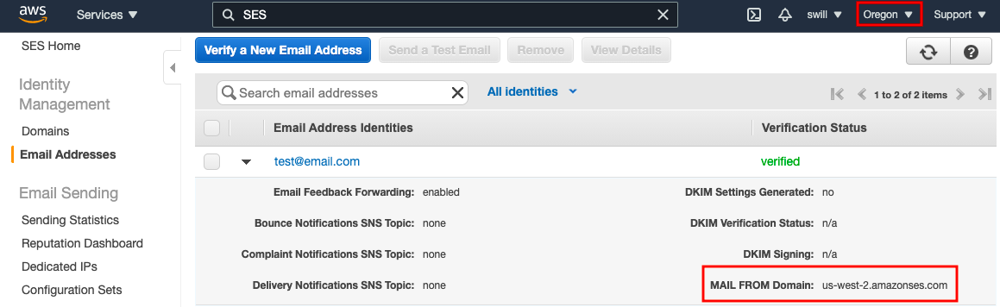

Amazon Simple Email Service (Amazon SES) is an email platform that provides a way to send and receive emails using your own email addresses and domains.

## Setting up Amazon SES

In order to send and receive emails we will need to verify the emails for both the sender and receiver. Navigate to `Amazon Simple Email Service` and click on `Identity Management` > `Email Addresses`.

From here verify two email addresses that we'll use in the next steps. It's also possible to use the same email address as the sender and receiver if you only want to verify one email.

>Note the region which the email addresses are associated with, this will be the region which we create the lambda function in the next step. For example `us-west-2`. The region can be changed by clicking on the region next to your profile name.

> If you later want to send emails to unverified emails you need to request [SES Production Access](https://docs.aws.amazon.com/ses/latest/DeveloperGuide/request-production-access.html).
