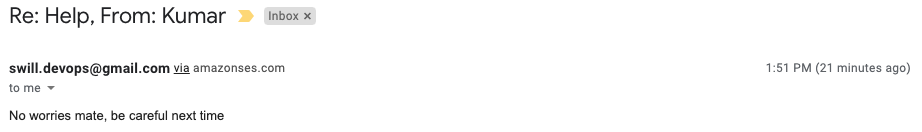

## Testing and Executing our Function

In order to test our function we will need to create a test template in AWS by pressing the `Test` button. These templates are used to configure the event object that is passed to the lambda function. In this case the function does not use any information from the event object, as such it does not matter what we write in the test template payload.

Save the template with any name (Ex. `testEvent`) and click the Test button again to test the lambda.

> If you get an error about unverified email addresses, double check that they are verified in the same region that you run your lambda function.

If there are no errors you should receive an email at the destination address.

> Also note that the email says 'via amazonses.com'

