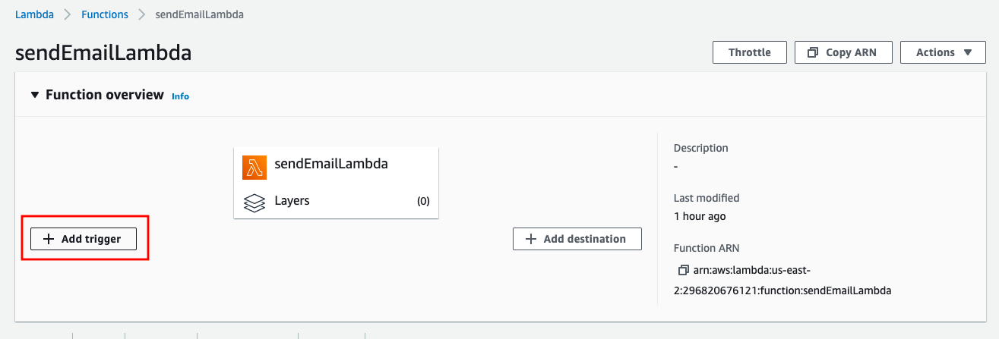
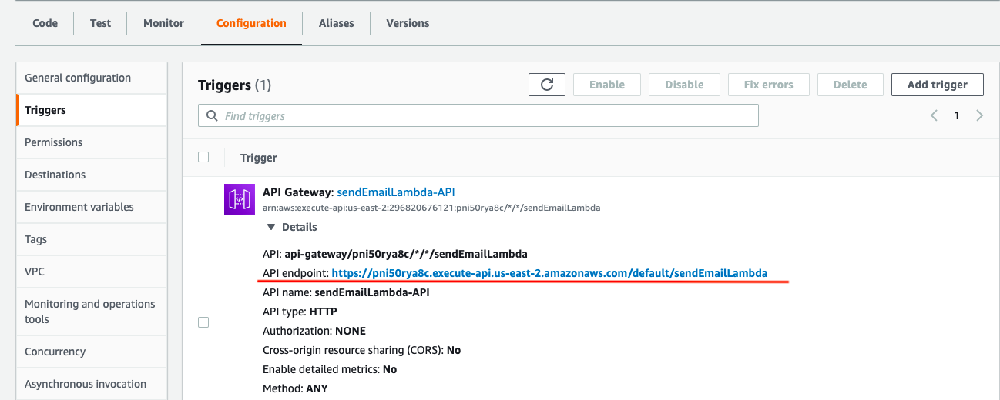

A trigger is a Lambda resource or a resource in another service that you configure to invoke your function in response to events, external requests, or on a schedule. A lambda can have multiple triggers and each trigger acts as a client invoking your function independently.

## Creating an HTTP Endpoint

Finally let's create a trigger to invoke our lambda. Simply click on `Add Trigger` from the lambda overview and select `API Gateway`. Then create a new `HTTP API` with security `Open` and press `Add`.
  

  

Now whenever this http request is called our lambda function will run and send an email. Try it out by copying the endpoint and pasting it in the browser:
  

> For more information on how to invoke the lambda with an actual SES domain see this [link](https://docs.aws.amazon.com/ses/latest/DeveloperGuide/receiving-email-action-lambda.html).
